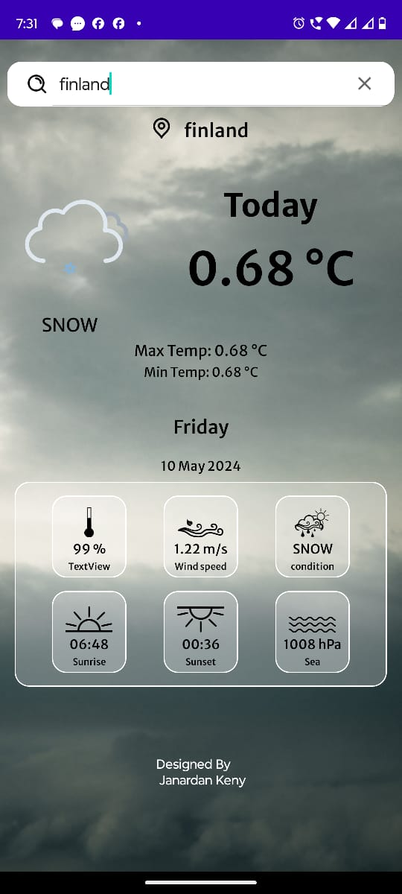

<h1 align="center">Weather App in kotlin</h1>
<h3 align="center">Developed a Weather App using Kotlin for Android, integrating the OpenWeather API. 
Location-Based Weather: provides weather information based on location. 
Search Functionality: Allows users to search for weather information in other cities 
User-Friendly Interface: Designed with an intuitive and user-friendly interface for easy navigation and use. 
The app provides users with weather information for their location and other selected cities. 
Uses Lotti Animations for better UI experience 
</h3>

 

